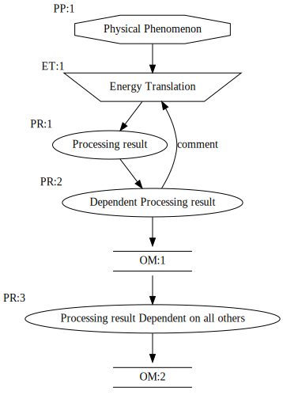

# sensesGraphBuilder
This is a tool that translates text to graphs with graphviz and regex

# Use
run the script with the only argument being the path to a text file containing a graph definition. This will generate an svg of the same name.

# Format

A node is denoted `<Label>:<TYPE>:<NUM>`  

An edge is denoted either `<NODE><Connector><NODE>`  
    where nodes can be either `<TYPE>:<NUM>` or `<Label>`  
    Connectors can be one of -/<-> for bidirectional -> for forwards or <- for backwards  

An example graph is:  

`Physical Phenomenon:PP:1->Energy Translation:ET:1`  
`Energy Translation->Processing result:PR:1`  
`PR:1->Dependent Processing result:PR:2`  
`PR:2->ET:1 #comment`  
`PR:2->OM:1`  
`inline comment can be made wherever`
`OM:1->Processing result Dependent on all others:PR:3`  
`PR:3->OM:2`  

This gets turned into :  

by running `python graphbuilder.py README.md` it's beautiful all the stuff that isn't a graph is simply ignored.
